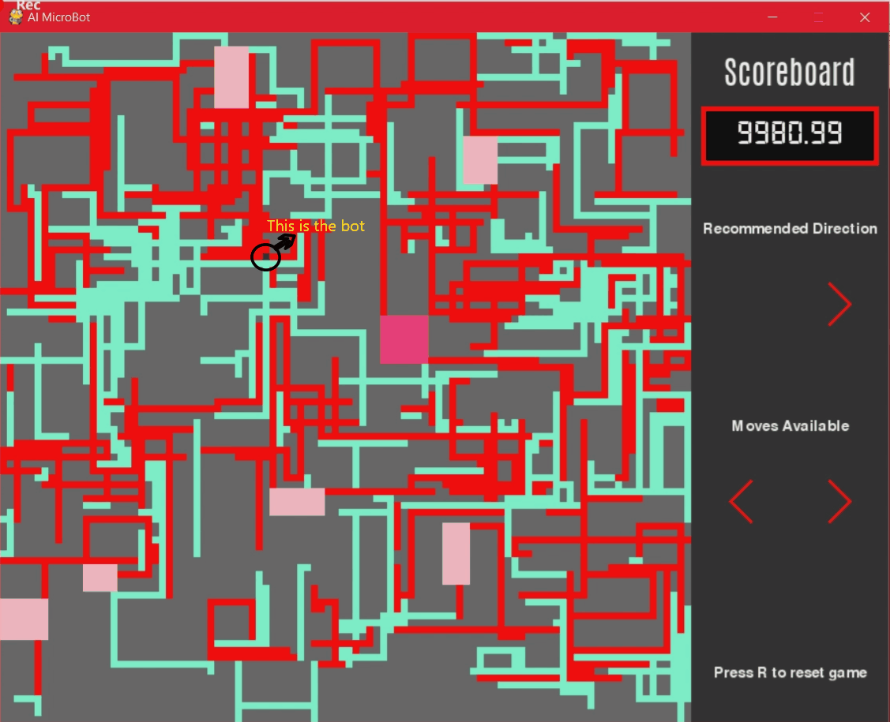

# AI-Microbot

A prototype of an Artificially Intelligent Microbot for targeted drug delivery in the human circulatory system. A prototype map consisting of Arteries, Veins, Capillaries, and Organs each having their own set of characteristics and properties is randomly generated. The micro-bot, having a set of sensors and electromagnets, will have to traverse the map given a randomly generated starting point and target organ in the most optimal path possible. The bot's speed in the system will also depend on the thickness of the blood vessel.

## Circulatory System
1. Arteries: Denoted by red pipes, arteries have a thickness varying between. Blood flow and hence bot movement is available in both directions.
2. Veins: Veins are dentoed by cyan colored pipes. They have a thickness varying between . Blood flow is only available in one direction.
3. Organs: Organs denoted by pink colored rectangles are the target sites for the microbot.

## Microbot
 The microbot has been trained with the A* Search Algorithm keeping a set of heuristics in mind. The AI will recommend the most optimal direction that the doctor must move in by looking ahead with its sensors and deducing the least cost paths. It will receive feedback on how successful it's journey has been based on a reward system.
 
## Setup

### Install Packages

To install the numpy library run

```
pip install numpy
```

To check the library which are already installed on your PC use command

```
pip list
```
 
 

## Getting Started


### Installing


## Running Tests


The AI recommends the optimal direction that the Doctor must move in by looking ahead and finding the least cost path. This isn't always accuracte, which is where the Doctor's discretion comes into play and he makes his own call.
